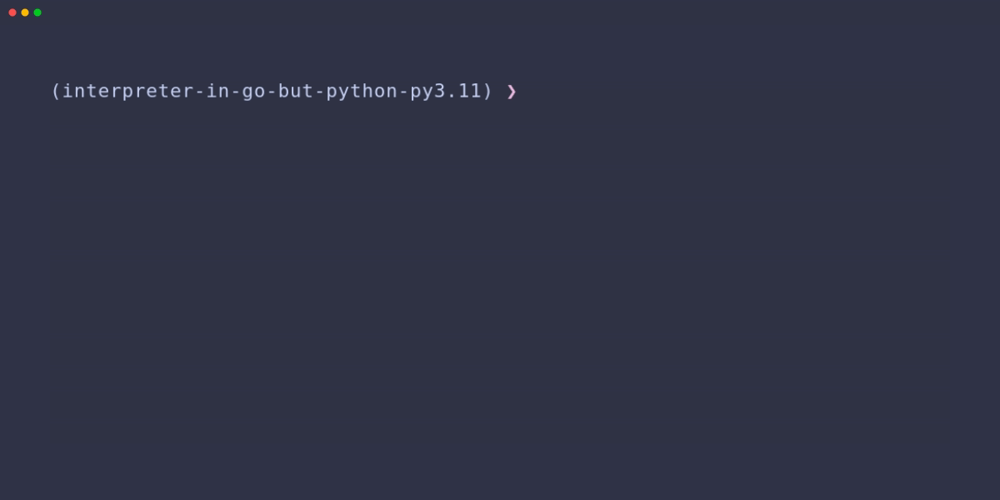

# interpreter-in-go-but-python

Inspired by ThePrimeagen's [ts-rust-zig-deez](https://github.com/ThePrimeagen/ts-rust-zig-deez) project that is based on ["Writing An Interpreter In Go"](https://interpreterbook.com/) book by Thorsten Ball

Current version - **Chapter 1 - Lexing - Completed**



NOTE:

- Some of the following description is copied from https://github.com/ThePrimeagen/ts-rust-zig-deez/blob/master/python/README.rst

**interpret_deez** is a Python implementation of a lexical analyzer that provides comprehensive scanning and lookahead capabilities. It also implements a parser that comes with awesome functionalities.

## 🛠️ Requirements

**interpret_deez** was tested Python 3.11.

Recommended and used tools:

- [pyenv](https://github.com/pyenv/pyenv#installation)
- [poetry](https://python-poetry.org/)

## 🚸 Setup

```bash
❯ git clone https://github.com/ltsuda/interpreter-in-go-but-python
❯ poetry shell
Spawning shell within /home/ltsuda/developer/interpreter-in-go-but-python/.venv
❯ emulate bash -c '. /home/ltsuda/developer/interpreter-in-go-but-python/.venv/bin/activate'

(interpreter-in-go-but-python-py3.11) ❯ poetry install
Installing dependencies from lock file

Package operations: 18 installs, 1 update, 0 removals

  • Installing distlib (0.3.7)
  • Installing filelock (3.12.3)
  • Installing platformdirs (3.10.0)
  • Updating setuptools (66.0.0 -> 68.2.1)
  • Installing cfgv (3.4.0)
  • Installing click (8.1.7)
  • Installing identify (2.5.28)
  • Installing iniconfig (2.0.0)
  • Installing mypy-extensions (1.0.0)
  • Installing nodeenv (1.8.0)
  • Installing packaging (23.1)
  • Installing pathspec (0.11.2)
  • Installing pluggy (1.3.0)
  • Installing pyyaml (6.0.1)
  • Installing virtualenv (20.24.5)
  • Installing black (23.7.0)
  • Installing pre-commit (3.4.0)
  • Installing pytest (7.4.0)
  • Installing ruff (0.0.287)

Installing the current project: interpreter-in-go-but-python (1.0.0)

(interpreter-in-go-but-python-py3.11) ❯
```

## 👨‍💻 Usage

```bash
(interpreter-in-go-but-python-py3.11) ❯ python
Python 3.11.5 (main, Sep  1 2023, 21:34:18) [GCC 11.4.0] on linux
Type "help", "copyright", "credits" or "license" for more information.
>>> from interpret_deez import lexer
>>> input = "!-/*5[];"
>>> lex = lexer.Lexer(input)
>>> for _ in range(9):
...   lex.next_token()
...
Token(type='!', literal='!')
Token(type='-', literal='-')
Token(type='/', literal='/')
Token(type='*', literal='*')
Token(type='INT', literal='5')
Token(type='[', literal='[')
Token(type=']', literal=']')
Token(type=';', literal=';')
Token(type='EOF', literal='')
```

## 🧪 Testing

```bash
(interpreter-in-go-but-python-py3.11) ❯ poetry run pytest
======================================================================================== test session starts =========================================================================================
platform linux -- Python 3.11.5, pytest-7.4.0, pluggy-1.3.0
rootdir: /home/ltsuda/developer/interpreter-in-go-but-python
collected 1 item

tests/test_lexer.py .                                                                                                                                                                          [100%]

========================================================================================= 1 passed in 0.02s ==========================================================================================
```
