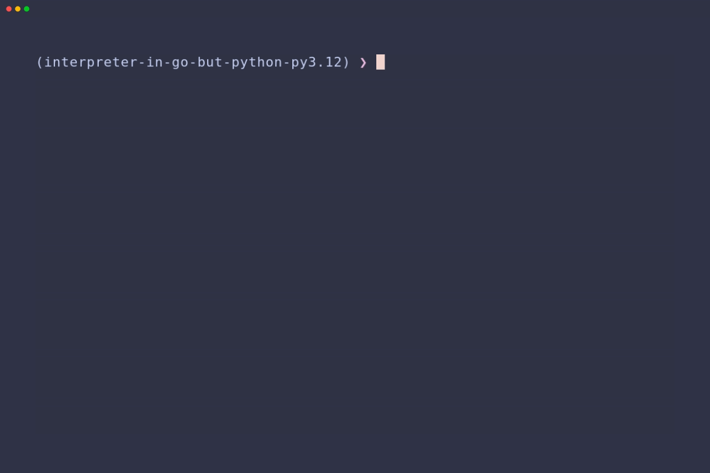

# interpreter-in-go-but-python

Inspired by ThePrimeagen's [ts-rust-zig-deez](https://github.com/ThePrimeagen/ts-rust-zig-deez) project that is based on ["Writing An Interpreter In Go"](https://interpreterbook.com/) book by Thorsten Ball

Current version - **Chapter 3 - Evaluation - TODO**

## Chapter 1 - Lexer


## Chapter 2 - Parser (emulated REPL)



NOTE:

- Some of the following description is copied from https://github.com/ThePrimeagen/ts-rust-zig-deez/blob/master/python/README.rst

**interpret_deez** is a Python implementation of a lexical analyzer that provides comprehensive scanning and lookahead capabilities. It also implements a parser that comes with awesome functionalities.

## 🛠️ Requirements

**interpret_deez** was tested Python 3.11 and 3.13.

Recommended and used tools:

- [mise](https://mise.jdx.dev/getting-started.html)
- [uv](https://docs.astral.sh/uv/)

## 🚸 Setup

```bash
❯ git clone https://github.com/ltsuda/interpreter-in-go-but-python
❯ uv venv
❯ source .venv/bin/activate
.venv ❯ uv sync

Resolved 24 packages in 7ms
Installed 22 packages in 42ms
 + asttokens==2.4.1
 + cfgv==3.4.0
 + distlib==0.3.9
 + executing==2.2.0
 + filelock==3.17.0
 + identify==2.6.7
 + iniconfig==2.0.0
 + littleutils==0.2.4
 + nodeenv==1.9.1
 + packaging==24.2
 + platformdirs==4.3.6
 + pluggy==1.5.0
 + pre-commit==4.1.0
 + pytest==8.3.4
 + pytest-check==2.5.0
 + python-defer==0.2.1
 + pyyaml==6.0.2
 + ruff==0.9.7
 + six==1.17.0
 + sorcery==0.2.2
 + virtualenv==20.29.2
 + wrapt==1.17.2
```

## 👨‍💻 Usage

### Lexer

```bash
.venv ❯ python
Python 3.13.2 (main, Feb  5 2025, 19:11:32) [Clang 19.1.6 ] on linux
Type "help", "copyright", "credits" or "license" for more information.
>>> from interpret_deez import lexer
>>> input = "!-/*5[];"
>>> lex = lexer.Lexer(input)
>>> for _ in range(9):
...     lex.next_token()
...
Token(type='!', literal='!')
Token(type='-', literal='-')
Token(type='/', literal='/')
Token(type='*', literal='*')
Token(type='INT', literal='5')
Token(type='[', literal='[')
Token(type=']', literal=']')
Token(type=';', literal=';')
Token(type='EOF', literal='')
```

### Parser

```bash
.venv ❯ python
Python 3.13.2 (main, Feb  5 2025, 19:11:32) [Clang 19.1.6 ] on linux
Type "help", "copyright", "credits" or "license" for more information.
>>> from interpret_deez import lexer, parser
>>> inp = "let parse_me = 1 * 2 * 3 * 4 * 5;"
>>> lex = lexer.Lexer(inp)
>>> pars = parser.Parser(lex)
>>> program = pars.parse_program()
>>> program.to_string()
'let parse_me = ((((1 * 2) * 3) * 4) * 5);'
```

## 🧪 Testing

```bash
.venv ❯ uv run pytest
================================================================================== test session starts ===================================================================================
platform linux -- Python 3.13.2, pytest-8.3.4, pluggy-1.5.0
rootdir: /home/mike/developer/interpreter-in-go-but-python
configfile: pyproject.toml
plugins: check-2.5.0
collected 62 items

tests/test_ast.py .                                                                                                                                                                [  1%]
tests/test_lexer.py .                                                                                                                                                              [  3%]
tests/test_parser.py ...sss......................................................                                                                                                  [100%]

========================================================================================= PASSES =========================================================================================
____________________________________________________________________________ test_tracer_operator_precedence _____________________________________________________________________________
---------------------------------------------------------------------------------- Captured stdout call ----------------------------------------------------------------------------------
BEGIN parse_expression_statement
        BEGIN parse_expression
                BEGIN parse_prefix_expression
                        BEGIN parse_expression
                                BEGIN parse_integer_literal
                                END parse_integer_literal
                        END parse_expression
                END parse_prefix_expression
                BEGIN parse_infix_expression
                        BEGIN parse_expression
                                BEGIN parse_integer_literal
                                END parse_integer_literal
                        END parse_expression
                END parse_infix_expression
                BEGIN parse_infix_expression
                        BEGIN parse_expression
                                BEGIN parse_integer_literal
                                END parse_integer_literal
                        END parse_expression
                END parse_infix_expression
        END parse_expression
END parse_expression_statement

Operator precedence for input: -1 * 2 + 3
Operator precedence expected result: (((-1) * 2) + 3)
============================================================================ 59 passed, 3 skipped in -28.89s =============================================================================
```
